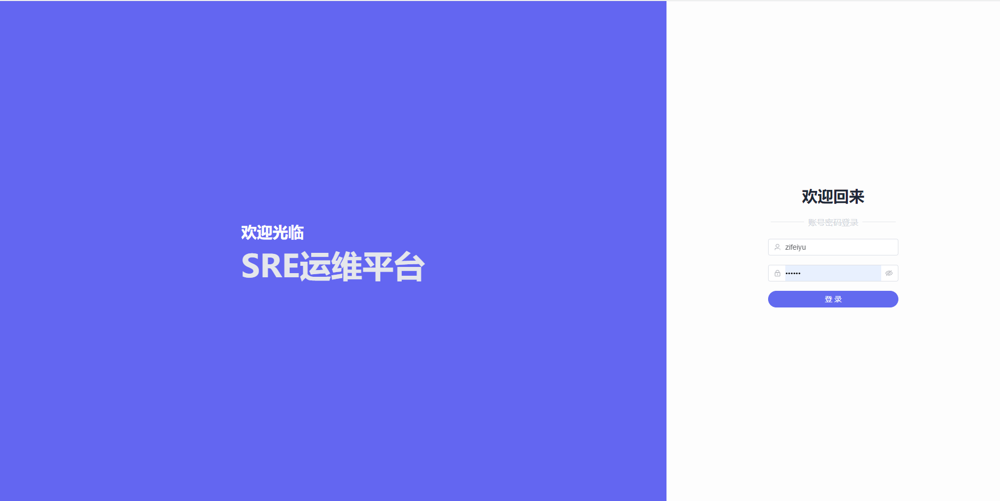
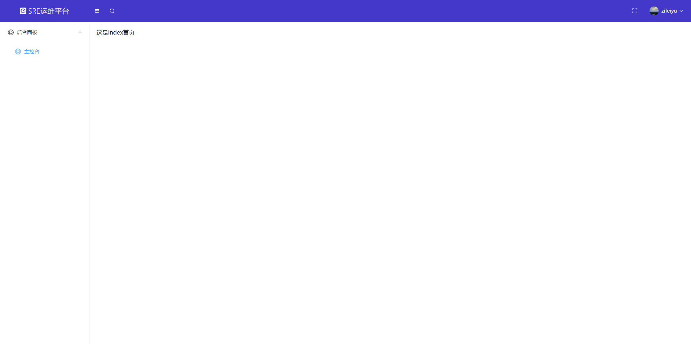
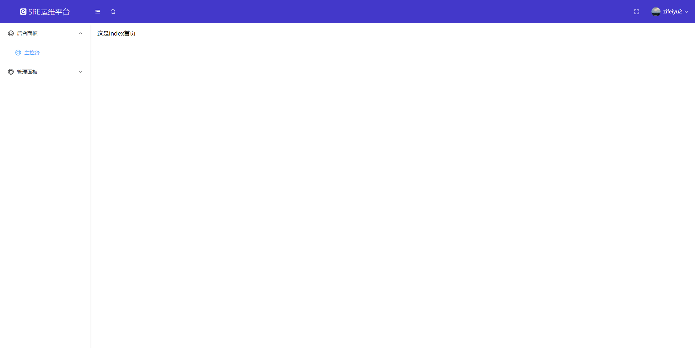

# vue3+vite权限管理系统前端模板

## 一、介绍

后端项目链接：`https://github.com/zi-fei-yu-2020/backend_system`

这是个vue3+Django的前后端分离项目

## 二、项目展示

### 1.登录页

### 2.首页

- zifeiyu账号查看界面

  

- zifeiyu2账号查看界面

  

## 三、技术架构

- vue3
- vite
- windicss
- Element-plus

## 四、亮点

配合后端实现权限控制，动态路由，每个权限的用户查看到的路由不同

## 五、随便说点

正好想搞这么一个，就搭了这么一个架子，后面的话内容还会继续补充的